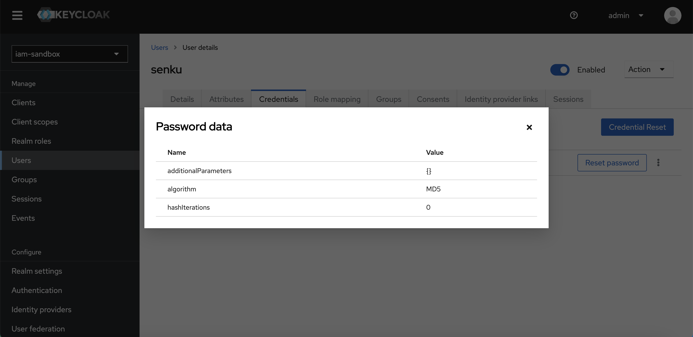

# Keycloak Playground

Playground for Keycloak. This playground use Keycloak version 25.0.6.

## Special Cases

### Migrate user data with hashing password algorithm MD5 to Keycloak

Keycloak only support PBKDF2 as hashing password algorithm. But, hashing password algorithm has been stored in user data use MD5. To make user can log in to Keycloak with their credential although hashing password change, we need to make a MD5 hashing password algorithm provider and put it to Keycloak. Luckily, I find a repository named [keycloak-md5 by mathsalmi](https://github.com/mathsalmi/keycloak-md5) to support this case. Here are the steps I do:

1. Requirements: You have JDK 11 and Maven in your local environment.
2. Clone [keycloak-md5 by mathsalmi](https://github.com/mathsalmi/keycloak-md5) repository.
3. Go to repository and run `mvn package`. This will generate a JAR package in `./target/keycloak-md5.jar`.
4. Copy that jar and put it in `providers` directory.
5. Make sure `docker-compose.yml` file mount the `providers` directory.
6. Run `docker compose up -d`.
7. Create realm in Keycloak e.g (`iam-sandbox`) and create a confidential client with OpenID Connect Protocol e.g `my-client` and set it with Service Account Roles and role of Service Account Roles named `realm-admin`.
8. I create a user with Keycloak Admin REST API and I'm using [ristekusdi/kisara-php](https://github.com/ristekusdi/kisara-php) because it wraps Keycloak Admin REST API and I'm using PHP programming language.

Here's the sneak peek of my code.

```php
<?php

require_once 'vendor/autoload.php';

use RistekUSDI\Kisara\User as KisaraUser;

// First option
$config = [
    'admin_url' => 'http://localhost:8180',
    'base_url' => 'http://localhost:8180',
    'realm' => 'iam-sandbox',
    'client_id' => 'my-client',
    'client_secret' => 'xxxxxxxxxxxxxxxxxxxxxx',
];

$data = [
    'firstName' => 'Senku',
    'lastName' => 'Ishigami',
    'email' => 'senku@dr.stone',
    'username' => 'senku',
    'enabled' => true,
    'credentials' => [
        [
            'algorithm' => 'MD5',
            'type' => 'password',
            'hashedSaltedValue' => md5('12345678'),
            'hashIterations' => 0,
            // You may set temporary if you want user to reset their password
            'temporary' => true,
        ]
    ],
];

$result = (new KisaraUser($config))->store($data);
print_r($result);
```

9. Test login user in http://localhost:8180/realms/iam-sandbox/account/ and you will be update the user password after log in.

Here's before and after user change their password. Please see the algorithm password hash.




**References**

- https://github.com/mathsalmi/keycloak-md5
- https://stackoverflow.com/questions/57771277/keycloak-migrating-hashed-passwords/74495363#74495363

### Intercepts Update Password

Example: The organization has Radius server that contains user accounts. These user accounts doesn't integrate with Keycloak because the organization don't want to. When user change their password in their Keycloak user account, the organization wants that password also change in their Radius user account.

> User change password => Update password in Keycloak user account + (Behind the scene) update password in Radius user account with the same password.

To facilitate this case, we will use one of Service Provider that provided by Keycloak: RequiredActionProvider.

**Prerequisites**

1. You already install Java Development Kit (JDK) that matched with Keycloak. In this case I use Keycloak version 25.0.6, so the JDK version is 21 LTS.
2. You already install Maven as a scaffolding project and build the plugin.

**Brief Steps**

1. Run maven command below to create a project.

```bash
mvn archetype:generate -DgroupId=stream.senku -DartifactId=senku-update-password -DarchetypeArtifactId=maven-archetype-quickstart -DinteractiveMode=false
```

2. Add `keycloak.version` and `java.release` as a properties to `pom.xml` file.

```xml
<properties>
    <keycloak.version>25.0.6</keycloak.version>
    <java.release>21</java.release>
</properties>
```

3. Add Keycloak dependencies into `<dependencies>` inside `pom.xml` file.

```xml
<dependencies>
    <!-- Keycloak -->
    <dependency>
      <groupId>org.keycloak</groupId>
      <artifactId>keycloak-core</artifactId>
      <version>${keycloak.version}</version>
      <scope>provided</scope>
    </dependency>
    <dependency>
      <groupId>org.keycloak</groupId>
      <artifactId>keycloak-server-spi</artifactId>
      <version>${keycloak.version}</version>
      <scope>provided</scope>
    </dependency>
    <dependency>
      <groupId>org.keycloak</groupId>
      <artifactId>keycloak-server-spi-private</artifactId>
      <version>${keycloak.version}</version>
      <scope>provided</scope>
    </dependency>
</dependencies>
```

4. Ignore `test` directory because we don't need it.

5. Create Provider class that implement custom password implementation.

6. Create `resources/META-INF/services` directory inside `src/main` directory and create `org.keycloak.authentication.RequiredActionFactory` inside it.

```bash
cd senku-update-password/src/main
mkdir -p resources/META-INF/services
cd resources/META-INF/services
touch org.keycloak.authentication.RequiredActionFactory
```